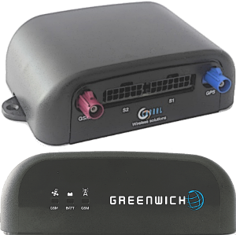

OrionMqtt
==============

Java MIDlet Project that includes Paho library to send Mqtt position messages with Choral Greenwich hardware

Motivation
----------

You want to monitor the position over time of your car, or a group of cars. Simply stated like this seems pretty stupid... but think of several situations where this would be nice to have:

- your car is being used by someone else, a friend or your son
- you park your car in a foreign town and don't want to forget where and how to get back there
- company cars, in a small company (big ones already have the same service delivered with a contract): check on your smartphone for real car availability, approaching or not, going away for a long travel.

The MQTT protocol is being used in this example, and this makes it possible to have plenty of automation.
You can easily configure your own special combination of information and alerts and find the right combination
with the wonderful tools listed below and many more (just look for "MQTT" on GitHub).

How it works
------------

(see also resources below) the key elements of this recipe:

- MQTT, a messaging protocol with pub/sub capabilities and its implementation (broker and client commands) called [Mosquitto](http://mosquitto.org/);
- [Choral Greenwich](http://www.choral.it/greenwich): the Java based GPS- and GPRS-enabled sensing box for vehicles.

Greenwich is capable of sending its location data to a server in this format:
Header,Device_ID,GPS_Valid,NumSat,Date,Time,Latitude,N/S,Longitude,E/W,Course,Speed,Altitude,Distance,BATT,E/B,DIN,DOUT,AIN*CK
Header,Device_ID,GPS_Valid,NumSat,Date,Time,Latitude,N/S,Longitude,E/W,Course,Speed,Altitude,Distance,BATT,E/B,DIN,DOUT,AIN,ALR<alarm>*CK

Examples:
$CHX,CHORAL1,A,07,060217,174624,4540.1420,N,01155.8320,E,12.6,0.06,95.6,012768,4.3V,E,01,00,FFFFFFFF*76
or
$CHX,CHORAL1,A,07,060217,174624,4540.1420,N,01155.8320,E,12.6,0.06,95.6,012768,4.3V,E,01,00,FFFFFFFF,ALR<ALIVE>*76

Greenwich is a Java programmable module.
For what we're interested at here, the simple usage model is having one ASCII string published as a MQTT message to a broker.
The string is NMEA-like and at the end it will send MQTT messages like (topic configurable):

- Topic: `/device/gw`
- Payload: `$CHX,gw,A,08,140526,144548,4540.83643,N,01156.48179,E,256.55,4.639,39.8,001967,4.3V,E,08,00,00000001*69`

Relevant elements (comma-separated values) of this example string are:

- `$CHX,gw`: identifies the origin, sort of name of the Greenwich module (can be configured);
- `4540.83643,N,01156.48179,E`: current position of Greenwich (ddmm.mmmmm);
- `4.3V`: internal battery level (volts).

Much more details are available, like discrete input levels, time, alarms etc. This message is being published to a configured broker address
each time Greenwich decides that a new position of the car should be updated (every few minutes when running for example).

Prerequisites
-------------

You will have:

- an instance of a MQTT broker installed somewhere, either a public server or a local machine or your workstation: Mosquitto with its default properties will do the job;
- one Greenwich module installed in your car and configured for NMEA-style messages mode, publishing strings again to your MQTT broker (you will also need a data SIM but this is another story...);

Configuration
-------------

You can configure your device using a pc connection or sending SMS configuration.

If you connect the device to a PC with a serial connection (115200bps 8/N/1 no flow control), you are able to configure the Greenwich.
Java application will start in about 40 seconds (the device switch on with ^SYSSTART urc, load bootloader, then switch to firmware application with
the second ^SYSSTART urc).
These are the basic commands to send:

#PWD 1234567890

then you can read the standard configuration sending #CFG.
The answer is:

Greenwich rev. 1.20, 28/05/2014
EGS5 rev.
IMEI: 3566120xxxxxxxx
#SETID: 2
#SNOP:
#GPRSCFG: web.omnitel.it,TCP,123.456.111.1,1883
#TRKCFG: IP,USR,$CHX,,1
#TRKTM: 1
#TRK: OFF
#PUBTOPIC: 10000038/1/
#SLPTM: 6
#SLP: OFF
#STILLTM: 5
#MOVSENS: OFF
#IGNCFG:
#UARTCFG: 115200,DIS,RS232,\n,0,0,\n,RS232,50
#SIG: 24,8
#VBAT: 4.4V

#ACK_OK

You can enable the tracking writing #TRK ON
In this configuration, the device will open a mqtt connection with the server "123.456.111.1" and it will publish a message with the topic 10000038/1/"SETID".
A message example is:

10000038/1/2 $CHX,2,A,09,140603,091722,4540.90125,N,01157.72655,E,0.00,0.017,69.4,000000,4.4V,E,08,00,00000000*24

where 10000038/1/2 the number 2 is the device ID, configurable writing the command #SETID <id> (in this case id=2).
You can find the message description inside the software manual.

If you want change the GPRS configuration, you must use the command:

#GPRSCFG web.omnitel.it,TCP,123.456.111.1,1883

where you can change APN, and broker server (in this example apn = web.omnitel.it and the server = 123.456.111.1)
For example, you can write:

#GPRSCFG ibox.tim.it,TCP,456.123.123.123,1883

It depends from your SIM operator and your broker server address.
If you change the GPRSCFG, the device will reboot to change the configuration.

It is possible to change tracking time using #TRKTM <time>
Where "time" can be set in minutes (example #TRKTM 5) or in seconds (example #TRKTM 300s).

For other commands, you can refer to the software manuals.

Resources
---------

* http://mosquitto.org/
* http://www.choral.it/greenwich

Contact
-------

* Author: [Choral] Matteo Bosco (http://www.choral.it)
* Email: matteo DOT bosco AT choral DOT it
* Email: stefano DOT costa AT bluewind DOT it
